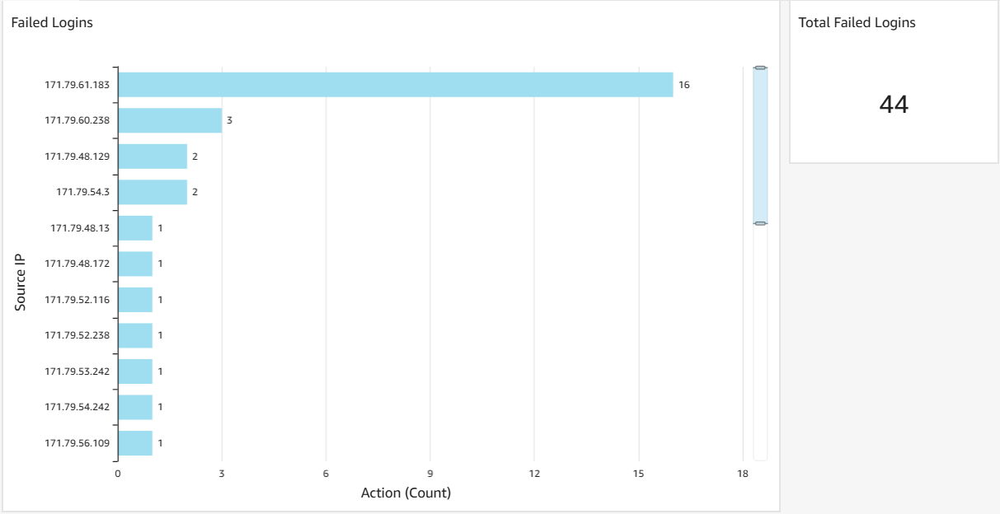
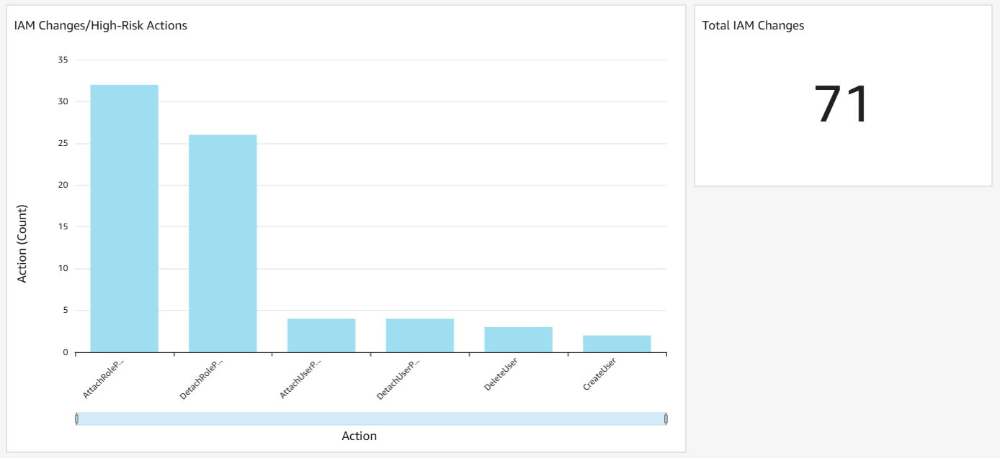
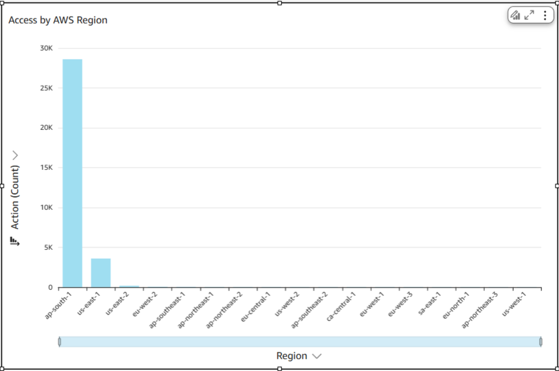
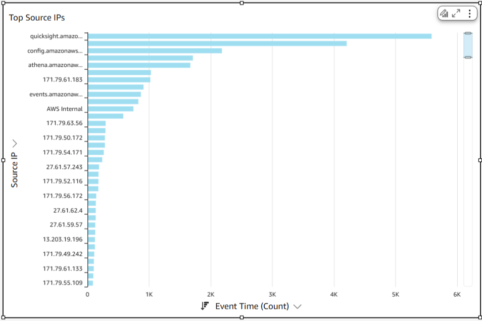
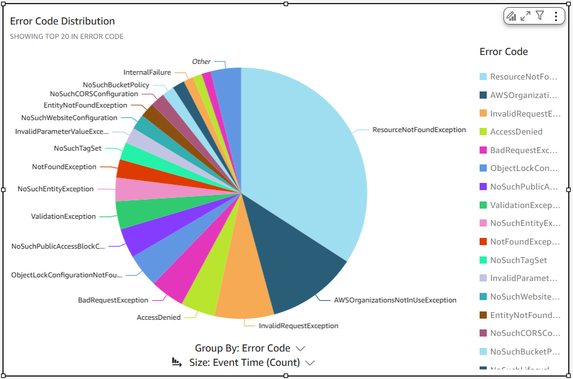
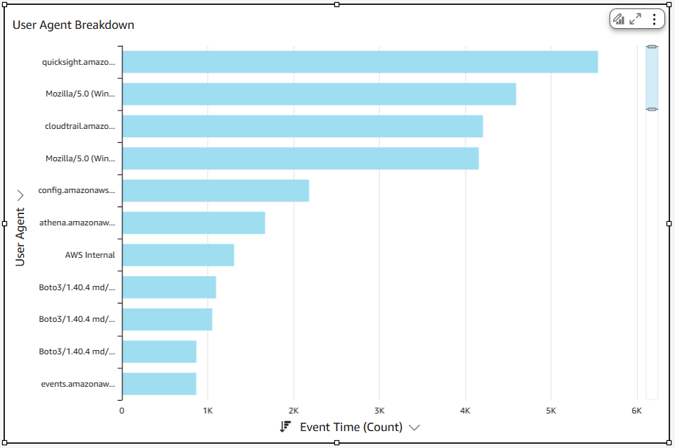

# End-to-End AWS Threat Detection & Monitoring System – Detailed Documentation

## 1. Project Overview

**Purpose:** Detect, monitor, and visualize AWS account threats.

This project implements a fully automated cloud threat detection and monitoring pipeline on AWS.  
The flow is truly end-to-end:
```plaintext
CloudTrail → S3 → Athena → Lambda → GuardDuty → Security Hub → EventBridge/SNS → QuickSight dashboards
```
It’s called "end-to-end" because it covers **raw log collection**, **automated detection**, **continuous monitoring**, **real-time alerts**, and **visualization**.

### Why Athena + Lambda + GuardDuty?
- **Athena:** Query large CloudTrail logs on-demand without managing servers.  
- **Lambda:** Adds automation and structured storage, so you don’t need to manually run queries every time.  
- **GuardDuty:** Monitors continuously for advanced threats not captured by static SQL queries (e.g., unknown malicious IPs, crypto-mining attempts).

### Real-Life Relevance
This setup is a simplified **SOC (Security Operations Center) pipeline**. In production, you’d integrate:  
- Anomaly detection or ML (e.g., Amazon Detective)  
- SIEM tools (Splunk, ELK)  
- Threat intelligence feeds and custom rules  
- CloudWatch alarms for real-time monitoring

---

## 2. Architecture

**Flow Diagram:**
```plaintext
CloudTrail → S3 → Athena → Lambda → EventBridge (schedules queries) → S3 (results) → QuickSight
          ↘ GuardDuty → Security Hub → EventBridge (alerts) → SNS → Notifications
```

**Component Roles:**
- **CloudTrail:** Captures all AWS account API activity.  
- **S3:** Stores raw CloudTrail logs and Athena/Lambda outputs.  
- **Athena:** SQL engine to query CloudTrail logs.  
- **Lambda:** Automates Athena queries dynamically, schedules via EventBridge.  
- **EventBridge (Schedules):** Runs Lambda every 15 minutes.  
- **GuardDuty:** Detects advanced threats and anomalies.  
- **Security Hub:** Aggregates GuardDuty findings.  
- **SNS:** Sends email/SMS alerts from EventBridge rules.  
- **QuickSight:** Dashboards for monitoring security metrics.

---

## 3. Athena Queries

**Example: Failed Logins Detection**
```sql
SELECT userIdentity.userName AS user, sourceIPAddress AS ip,
COUNT(*) AS failed_attempts
FROM cloudtrail_logs.cloudtrail_events
WHERE eventName = 'ConsoleLogin'
AND errorMessage IS NOT NULL
GROUP BY userIdentity.userName, sourceIPAddress
HAVING COUNT(*) > 5
ORDER BY failed_attempts DESC
LIMIT 50;
```
Purpose: Detect brute-force attempts or suspicious failed logins.

**Example: IAM Policy Changes**
```sql
SELECT eventTime, eventName, userIdentity.userName, sourceIPAddress
FROM cloudtrail_logs.cloudtrail_events
WHERE eventSource = 'iam.amazonaws.com'
AND eventName IN ('CreateUser', 'DeleteUser', 'AttachRolePolicy', 'DetachRolePolicy', 'PutUserPolicy', 'UpdateUser', 'CreateRole', 'DeleteRole')
ORDER BY eventTime DESC
LIMIT 50;
```
Purpose: Identify critical IAM role or policy changes.

**SQL files are stored in `/1-Athena-Queries/` in the repo.**

Links to Queries in Repo:
 - [Root Account Usage](../1-Athena-Queries/3-RootAccntUsage.sql)
 - [Unusual Region Access](../1-Athena-Queries/4RegionAccess.sql)  
 - [High Risk Actions](../1-Athena-Queries/5-HighRiskActions.sql)  
 - … (other queries are in the folder)


---

## 4. Lambda Functions
**Lambda Functions Used:**
 - **`ThreatDetectionMonitoringLambda-aksh`** → Automates Athena queries and saves CSV results to S3.
 - **`SecurityHub-s3`** → Captures Security Hub findings and stores them in S3.

### How They Work:
 - Lambda reads SQL files dynamically from `Athena-Queries` in S3.
 - Executes queries via Athena API.
 - Saves outputs into `athena-results-aksh/athena-results`.
 - EventBridge runs it every 15 minutes automatically.

### Why Necessary:
Athena alone requires manual execution. Lambda provides automation, scheduling, and centralized storage, mimicking real-world SOC practices.

### Sample Event Payload (Testing):
```python
{
  "query": "1-FailedLogins.sql"
}
```

### Sample Lambda Output:
Stored in S3: `athena-results-aksh/athena-results/<QueryExecutionId>.csv`

---

## 5. GuardDuty Findings
- Simulated threats tested: IAM credential misuse, S3 data exfiltration, EC2 compromise.  
- GuardDuty flagged findings with **Critical, High, and Medium severities**.  
- Findings were visible in Security Hub, confirming integration.

---

## 6. Security Hub
- **Why:** Centralizes findings from GuardDuty (and optionally other services).  
- **Integration:** GuardDuty findings automatically appear in Security Hub.  
- **Usage:** Findings can be exported to S3 for visualization or reviewed directly.

---

## 7. EventBridge
**Usage:**
- **Lambda Scheduling:** EventBridge runs `ThreatDetectionMonitoringLambda-aksh` every 15 minutes.  
- **GuardDuty Alerts:** Captures Security Hub findings and forwards them to SNS.

---

## 8. Alerts (EventBridge + SNS)
- EventBridge Rule monitors GuardDuty findings.  
- Triggers SNS Topic → Sends alerts to subscribed emails/SMS.  

**Workflow:**
GuardDuty → Security Hub → EventBridge Rule → SNS → Email/SMS

---

## 9. Automation
- Lambda dynamically fetches all Athena queries from S3.  
- EventBridge schedules it automatically.  
- Results stored in S3 feed directly into QuickSight.  
- End-to-end: **no manual Athena query execution needed**.

---

## 10. QuickSight Dashboard

**Visuals Built (6)**

| Visual Name                   | Fields Used (X-axis, Value)      | Chart Type       | Extra Touch                          | Screenshot                                                              |
|-------------------------------|----------------------------------|------------------|--------------------------------------|-------------------------------------------------------------------------|
| Failed Logins                 | sourceipaddress, count()         | Bar Chart + KPI  | Filter: eventname='ConsoleLogin'     | |
| IAM Changes/High-Risk Actions | eventname, count()               | Bar Chart + KPI  | Filter: critical IAM actions         |   |
| Access by AWS Region          | awsregion, count()               | Bar Chart        | Highlight unexpected regions         |       |
| Top Source IPs                | sourceipaddress, count()         | Bar Chart        | Conditional formatting for repeats   | |
| Error Code Distribution       | errorcode, count()               | Pie Chart        | Shows common errors                  |    |
| User Agent Breakdown          | useragent, count()               | Horizontal Bar   | Compare API usage patterns           |    |

---

## 11. Results

From the Sept 2025 run (values vary over time):  
- **Total Events:** ~31,100  
- **Failed Logins:** 44  
- **IAM Changes:** 71 (CreateUser, DeleteUser, AttachRolePolicy, DetachRolePolicy)  
- **Distinct Error Codes:** 20+  
- **GuardDuty Findings:** Confirmed simulated detection of IAM misuse, S3 exfiltration, EC2 compromise.

These metrics update automatically as logs and detections evolve.

---

## 12. Repository Structure
```text
/aws-threat-detection-monitoring/
│── 1-Athena-Queries/              (SQL queries for CloudTrail analysis)
│     ├── 1-FailedLogins.sql
│     ├── 2-IAMChanges.sql
│     └── ...                      # Other queries
│
│── 2-Lambda/                      (Lambda functions for automation and Security Hub export)
│     ├── ThreatDetectionMonitoringLambda-aksh/
│     └── SecurityHub-s3/
│
│── 3-Athena-Results/              (CSV outputs generated from Athena query runs)
│     ├── 1-FailedLogins.csv
│     ├── 2-IAMChanges.csv
│     └── ...                      # Result files for all queries
│
│── 4-QuickSight-Screenshots/      (Exports of the 6 QuickSight dashboard visuals)
│     ├── 1-FailedLogins_Screenshot.png
│     ├── 2-IAMChanges_Screenshot.png
│     ├── 3-Region_Screenshot.png
│     ├── 4-TopSourceIPs_Screenshot.png
│     ├── 5-ErrorCode_Screenshot.png
│     └── 6-UserAgent_Screenshot.png
│
│── 5-Docs/
│     └── Documentation.docx       (Detailed documentation)
│
└── README.md                      (Main project overview and instructions)
```

---

## 13. Challenges & Insights

**Mistakes Encountered and How They Were Fixed:**
- **S3 Folder Path Errors:** Lambda results were initially stored in the wrong folder. Corrected paths to ensure proper organization for QuickSight ingestion.
- **Lambda Permissions:** Lambda lacked full S3 and Athena access. Updated IAM roles with precise policies.
- **Athena Workgroup Issues:** Some queries failed due to incorrect workgroup selection. Fixed by specifying the correct workgroup and S3 output location.
- **QuickSight Dataset Issues:** Missing fields or incorrect types caused incomplete visuals. Adjusted datasets and added calculated fields.
- **Timestamp Formatting:** Event time in string format caused QuickSight filtering issues. Converted or formatted fields for correct date-based analysis.

**Insights from Results:**
- Proper **S3 folder organization** is crucial for automated pipelines to feed results into dashboards correctly.  
- **Lambda + Athena automation** avoids manual query execution, but careful testing of IAM permissions and output paths is mandatory.  
- GuardDuty + Security Hub are critical for detecting anomalies **Athena queries might miss**, emphasizing the need for both static and dynamic detection.  
- QuickSight datasets need correct **field types and filters** to produce meaningful visuals.
- Failed Logins indicate patterns of potential **brute-force attacks**.
- IAM Changes reveals high-risk activity and potential **privilege escalation** attempts.
- Unusual Region Access shows the need for geolocation monitoring to find **impossible travel**.
- **GuardDuty Findings:** Confirmed simulated threats such as IAM compromise, S3 exfiltration attempts, and EC2 misuse, showing that static queries alone cannot detect all anomalies.
- **Automation Benefits:** End-to-end pipeline ensures continuous monitoring; results update automatically with incoming CloudTrail logs, reducing manual effort and human error.
- End-to-end testing of the pipeline (CloudTrail → Athena → Lambda → QuickSight → Alerts) helps identify **dependency gaps and timing issues** before production deployment.

---

## 14. Future Improvements
- Add Amazon Detective for anomaly detection.  
- Integrate SIEM tools like Splunk or ELK.  
- Automate QuickSight dataset refresh.  
- Include threat intelligence feeds or ML models for proactive defense.

---

## 15. License & Author Info
- License: Educational use only. No sensitive or production data used.  
- Author: Akshayah N S (Sept 2025)
